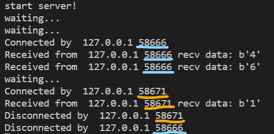
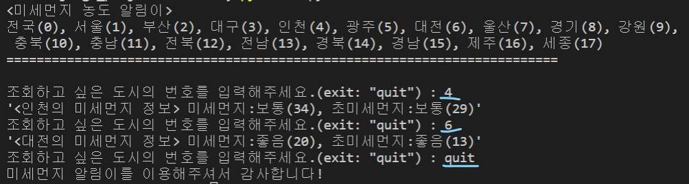
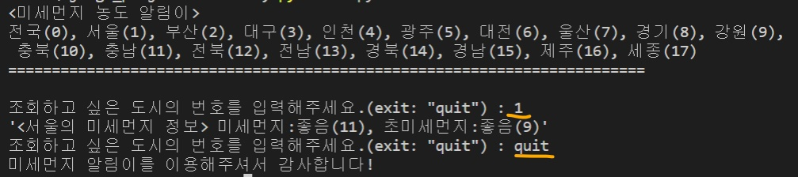

# TCP/IP 기말 과제 <미세먼지 알림이>

<h2>01. 개요</h2>

<h3>01-1 목적</h3>
미세먼지에 민감한 오늘날, 시도별로 실시간 미세먼지 측정정보를 쉽게 조회할 수 있도록 서비스를 제공하는 것이 해당 프로젝트의 목적이다.

<h3>01-2 기능</h3>
시도별 실시간 측정정보 조회
: 시도명을 검색조건으로 하여(시도명에 따른 번호 입력) 시도별 미세먼지 및 초미세먼지의 농도와 등급 정보 조회 기능을 제공

<h3>01-3 개발환경</h3>
개발언어: python
개발환경: Visual Studio Code

<h3>01-4 참고자료</h3>
삼전동해커, 파이썬 thread 소켓 프로그래밍, https://watchout31337.tistory.com/117
jvvp512, 파이썬 쓰레드(Thread) 알아보기-2: 뮤텍스(Lock), https://jvvp.tistory.com/1154

<h2>02. 실행결과</h2>

#서버 [server.py]

#클라이언트1 [client.py]

#클라이언트2 [client.py]

